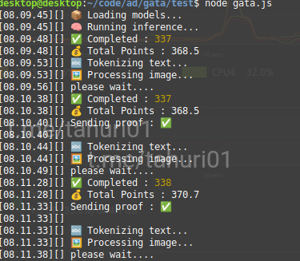

# BOT GATA DVA

# ⚠️ Requires high memory (RAM) usage, with a minimum of 1.5 GB free memory or more.



**FEATURE:**

**• DVA**

**• Supports Proxy w/o Proxy**

## REQUIREMENTS

Before running this project, make sure you have installed:

- Node.js
- npm (Node Package Manager)

## INSTALLATION

1. **Clone this repository:**

    ```plaintext
    git clone https://github.com/wrightL-dev/GATA
    cd GATA

2. **Install the required packages:**

    ```plaintext
    npm install onnxruntime-node@1.21.1 sharp follow-redirects https-proxy-agent socks-proxy-agent axios

3. **Add your accounts in the token.txt file. Example:**

    ```plaintext
   eyxxxxxx

4. **If you want to use a proxy, edit the proxy.txt file. Example:**
   ```plaintext
   http://username:password@ip:port

5. **Run the script:**
   ```plaintext
   node gata.js

5. **Run the script on Android (UserLand):**
   ```plaintext
   node gata-android.js
   
## SUPPORT

If you have any questions or need further assistance, feel free to join our Telegram channel at [t.me/tahuri01](https://t.me/tahuri01).

## LICENSE

This project is licensed under the [MIT License](LICENSE).
